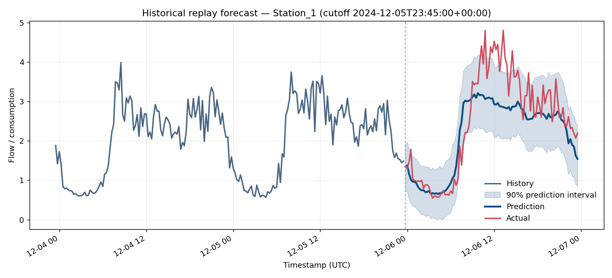
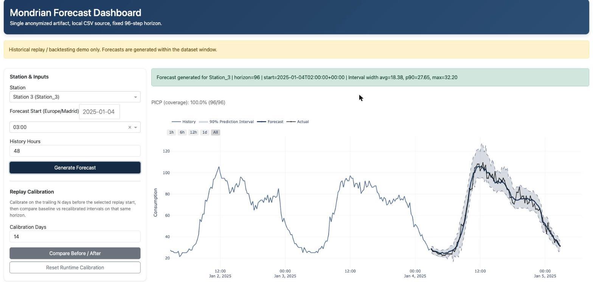
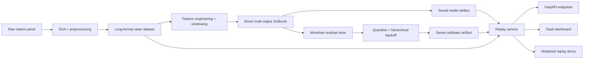

# Calibrated Prediction Intervals for Heteroscedastic Time Series

This repository is a public demo of an end-to-end time series pipeline I built for water-demand forecasting under strongly heteroscedastic behavior. The focus is not only point accuracy, but producing prediction intervals that stay calibrated across stations with very different volatility regimes.

The public demo includes:

- a preprocessing and EDA notebook for the synthetic/anonymized dataset
- a documented training notebook that explains the modeling and calibration pipeline
- a lightweight inference replay notebook that uses the saved demo artifacts directly
- a FastAPI + Dash service that replays historical forecasts and backtests from the saved artifact bundle
- a replay calibration flow that fits a runtime overlay on the trailing `N` days before a chosen historical cutoff and compares before/after intervals on the same window

## What This Project Shows

- why heteroscedastic demand makes naive global uncertainty estimates fail
- how station-aware scaling and feature engineering improve stability
- why a direct multi-output model is a good fit for fixed 96-step horizons
- how Mondrian conformal calibration can adapt interval widths by station, lead time, and time of day
- how to package a model, transforms, calibrator state, and replay service into a portfolio-ready demo

## Results

Real numbers from the historical replay backtest path (`scripts/compute_demo_metrics.py`, base intervals, no runtime overlays). Empirical coverage is measured against the nominal 90% target.

| Station | Coverage (target 0.90) | MAE | RMSE | Mean interval width | Replay windows |
| --- | ---: | ---: | ---: | ---: | ---: |
| Station_1 | 0.874 | 0.386 | 0.523 | 1.664 | 10 |
| Station_2 | 0.868 | 1.255 | 1.730 | 5.209 | 10 |
| Station_3 | 0.932 | 4.156 | 6.387 | 22.589 | 10 |
| Station_4 | 0.897 | 1.038 | 1.415 | 4.566 | 10 |
| Station_7 | 0.904 | 2.581 | 3.557 | 15.159 | 9 |
| Station_8 | 0.902 | 1.790 | 2.622 | 7.991 | 10 |
| **Overall** | **0.896** | **1.856** | **3.302** | **9.434** | **59** |

_Empirical coverage vs. a nominal 90% target, aggregated over 59 historical replay windows (base intervals, no runtime overlays), weighted by the number of valid forecast points. Regenerate with `python scripts/fetch_demo_model.py && python scripts/compute_demo_metrics.py`._



_Interactive dashboard (`/dashboard`):_



A live historical-replay window (Station_3, 2025-01-04) where the forecast tracks the actual closely — a strong/best-case window (PICP 100% on these 96 steps), not the typical case. See the Results table above for aggregate coverage across all stations and windows.

## Architecture



## Repository Guide

- `notebooks/01_eda_and_problem_setup.ipynb`: runnable notebook for the public dataset and preprocessing flow.
- `notebooks/02_training_pipeline_design.ipynb`: documented training pipeline. Useful to read; not intended as the primary public rerun path.
- `notebooks/03_inference_replay_demo.ipynb`: runnable replay notebook that loads the saved demo bundle directly.
- `app/`: FastAPI application and inference/calibration service classes.
- `dashboard/`: Dash UI mounted inside the FastAPI app.
- `mondrian_artifacts_demo/`: public demo artifact bundle used by the replay service.
- `scripts/`: entrypoints for running the API, validating the artifact, smoke-testing endpoints, and exporting notebooks.
- `docs/`: recruiter-facing technical notes and publishing guidance.

## Quickstart

1. Create an environment and install dependencies.

   ```bash
   python -m venv .venv
   source .venv/bin/activate
   pip install -r requirements.txt
   ```

2. Download the pinned release model asset.

   ```bash
   python scripts/fetch_demo_model.py
   ```

3. Validate the public demo artifact.

   ```bash
   python scripts/validate_demo_artifact.py
   ```

4. Run the replay API and dashboard.

   ```bash
   python scripts/run_demo_api.py
   ```

5. In a second terminal, run the smoke test.

   ```bash
   python scripts/smoke_test_demo_api.py --base-url http://127.0.0.1:8000
   ```

6. Render the public notebooks to HTML.

   ```bash
   python scripts/render_public_notebooks.py
   ```

After the API starts, the main entrypoints are:

- API docs: `http://127.0.0.1:8000/docs`
- Dashboard: `http://127.0.0.1:8000/dashboard`

## Public Demo Scope

This repository intentionally exposes a replayable demo, not a live production system.

- Forecasts are historical replays constrained to the dataset window.
- The active demo scope is fixed to six anonymized stations.
- Runtime calibration overlays are written under `runtime/` and kept separate from the base artifact.
- Internal source artifacts, API access logic, and private internship materials are not part of the public demo flow.

Replay calibration in this repo should be read as a historical simulation of runtime recalibration, not as a live streaming calibration service.

More detail:

- [`docs/design-decisions.md`](docs/design-decisions.md)
- [`docs/demo-scope.md`](docs/demo-scope.md)
- [`docs/artifact-schema.md`](docs/artifact-schema.md)
- [`docs/publishing-checklist.md`](docs/publishing-checklist.md)

## Recommended Reading Order

1. Start with `notebooks/01_eda_and_problem_setup.ipynb`.
2. Read `docs/design-decisions.md`.
3. Open `notebooks/03_inference_replay_demo.ipynb`.
4. Skim `notebooks/02_training_pipeline_design.ipynb` for the full modeling and calibration flow.
5. Run the API and dashboard if you want the interactive service view.

## Model Asset

The repo keeps the large model binary out of git and fetches it from the pinned GitHub Release `v0.1.0`.

- Manifest: `mondrian_artifacts_demo/meta/model_asset.json`
- Fetch command: `python scripts/fetch_demo_model.py`

The fetch script verifies:

- the model file SHA256
- the uploaded `.sha256` asset hash
- the checksum file content against the expected model hash
